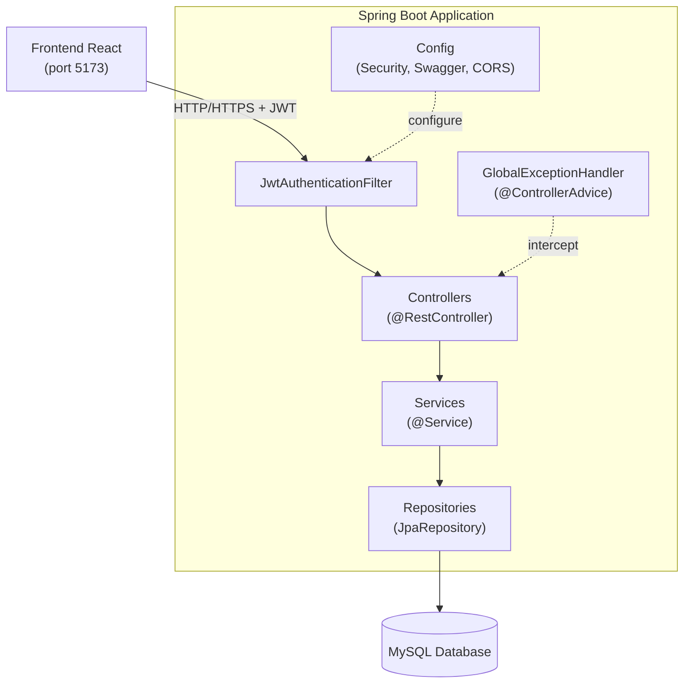
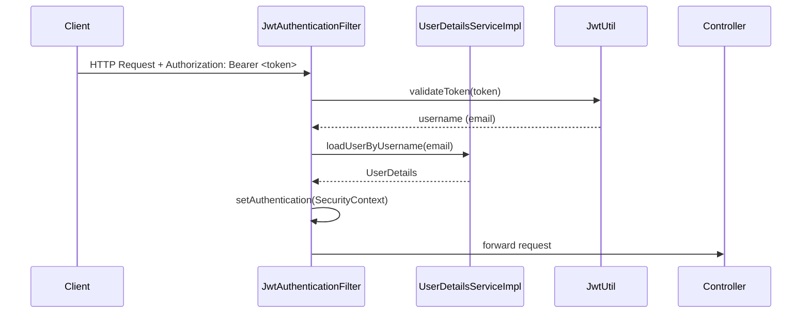
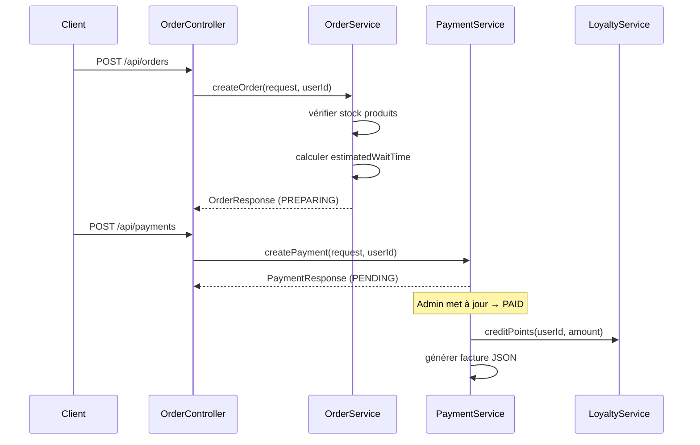
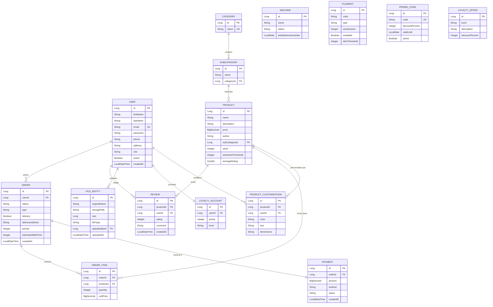

# Document de Conception Technique — LayerLab Backend

## Vue d'ensemble

LayerLab Backend est une API REST développée avec Spring Boot 3.x, exposant les fonctionnalités d'un service d'impression 3D : authentification JWT, gestion du catalogue produits, upload de fichiers 3D, gestion des machines et filaments, commandes, paiements, fidélisation et tableau de bord administrateur.

L'API est consommée par un frontend React (Vite, port 5173). Elle est stateless : chaque requête porte un token JWT dans l'en-tête `Authorization: Bearer <token>`. Les rôles sont `ROLE_USER` (client) et `ROLE_ADMIN`.

### Objectifs de conception

- Architecture en couches stricte : Controller → Service → Repository → Entity
- Séparation claire entre DTOs (entrée/sortie) et entités JPA
- Gestion centralisée des erreurs via `@ControllerAdvice`
- Sécurité déclarative via Spring Security + filtre JWT
- Documentation auto-générée via SpringDoc OpenAPI 3

---

## Architecture

### Vue d'ensemble des couches



### Structure des packages

```
com.layerlab.backend
├── config/
│   ├── SecurityConfig.java
│   ├── SwaggerConfig.java
│   └── CorsConfig.java
├── controller/
│   ├── AuthController.java
│   ├── CategoryController.java
│   ├── ProductController.java
│   ├── FileController.java
│   ├── MachineController.java
│   ├── FilamentController.java
│   ├── OrderController.java
│   ├── PaymentController.java
│   ├── LoyaltyController.java
│   ├── DashboardController.java
│   └── UserController.java
├── service/
│   ├── AuthService.java / AuthServiceImpl.java
│   ├── CategoryService.java / CategoryServiceImpl.java
│   ├── ProductService.java / ProductServiceImpl.java
│   ├── FileService.java / FileServiceImpl.java
│   ├── MachineService.java / MachineServiceImpl.java
│   ├── FilamentService.java / FilamentServiceImpl.java
│   ├── OrderService.java / OrderServiceImpl.java
│   ├── PaymentService.java / PaymentServiceImpl.java
│   ├── LoyaltyService.java / LoyaltyServiceImpl.java
│   └── DashboardService.java / DashboardServiceImpl.java
├── repository/
│   ├── UserRepository.java
│   ├── CategoryRepository.java
│   ├── SubCategoryRepository.java
│   ├── ProductRepository.java
│   ├── ProductCustomizationRepository.java
│   ├── ReviewRepository.java
│   ├── FileEntityRepository.java
│   ├── MachineRepository.java
│   ├── FilamentRepository.java
│   ├── OrderRepository.java
│   ├── OrderItemRepository.java
│   ├── PaymentRepository.java
│   ├── PromoCodeRepository.java
│   ├── LoyaltyAccountRepository.java
│   └── LoyaltyOfferRepository.java
├── entity/
│   ├── User.java
│   ├── Category.java
│   ├── SubCategory.java
│   ├── Product.java
│   ├── ProductCustomization.java
│   ├── Review.java
│   ├── FileEntity.java
│   ├── Machine.java
│   ├── Filament.java
│   ├── Order.java
│   ├── OrderItem.java
│   ├── Payment.java
│   ├── PromoCode.java
│   ├── LoyaltyAccount.java
│   └── LoyaltyOffer.java
├── dto/
│   ├── request/   (RegisterRequest, LoginRequest, ProductRequest, ...)
│   └── response/  (AuthResponse, ProductResponse, OrderResponse, ...)
├── security/
│   ├── JwtUtil.java
│   ├── JwtAuthenticationFilter.java
│   └── UserDetailsServiceImpl.java
└── exception/
    ├── ResourceNotFoundException.java
    ├── ConflictException.java
    ├── ForbiddenException.java
    ├── UnprocessableEntityException.java
    └── GlobalExceptionHandler.java
```

---

## Composants et Interfaces

### Sécurité JWT



**JwtUtil** : génère et valide les tokens JWT (algorithme HS256, expiration 24h, secret stocké dans `application.properties`).

**JwtAuthenticationFilter** : filtre `OncePerRequestFilter` qui extrait le token de l'en-tête, le valide et injecte l'authentification dans le `SecurityContext`.

**UserDetailsServiceImpl** : implémente `UserDetailsService`, charge l'utilisateur depuis `UserRepository` par email.

### Gestion des erreurs

Toutes les exceptions métier héritent d'une hiérarchie commune :

```
RuntimeException
├── ResourceNotFoundException    → HTTP 404
├── ConflictException            → HTTP 409
├── ForbiddenException           → HTTP 403
└── UnprocessableEntityException → HTTP 422
```

**GlobalExceptionHandler** (`@ControllerAdvice`) intercepte :
- `ResourceNotFoundException` → 404
- `ConflictException` → 409
- `ForbiddenException` → 403
- `UnprocessableEntityException` → 422
- `MethodArgumentNotValidException` → 400 (validation Hibernate)
- `Exception` (catch-all) → 500

Format de réponse d'erreur uniforme :
```json
{
  "status": 404,
  "message": "Produit introuvable avec l'id : 42",
  "timestamp": "2025-01-15T10:30:00Z",
  "path": "/api/products/42"
}
```

### Flux de commande



---

## Modèles de données

### Diagramme entité-relation



### Enums

| Enum | Valeurs |
|------|---------|
| `Role` | `ROLE_USER`, `ROLE_ADMIN` |
| `MachineStatus` | `AVAILABLE`, `IN_USE`, `MAINTENANCE` |
| `OrderStatus` | `PREPARING`, `READY`, `DELIVERING`, `DELIVERED` |
| `OrderType` | `ONLINE`, `PHONE` |
| `PaymentMethod` | `CASH`, `BANK_TRANSFER` |
| `PaymentStatus` | `PENDING`, `PAID`, `CANCELLED` |
| `LoyaltyLevel` | `BRONZE`, `SILVER`, `GOLD` |

### Règles métier sur les données

- **LoyaltyLevel** calculé dynamiquement : BRONZE [0–499], SILVER [500–1999], GOLD [≥2000]
- **averageRating** recalculé à chaque ajout/suppression d'avis
- **estimatedWaitTime** = nombre de commandes PREPARING × temps moyen par commande (configurable)
- **stockAlertThreshold** par défaut : 5 unités ; **alertThreshold** filament par défaut : 500 grammes
- **maintenanceAlert** : true si `lastMaintenanceDate` > 30 jours avant aujourd'hui

---

## Propriétés de Correction

*Une propriété est une caractéristique ou un comportement qui doit être vrai pour toutes les exécutions valides d'un système — essentiellement, un énoncé formel de ce que le système doit faire. Les propriétés servent de pont entre les spécifications lisibles par l'humain et les garanties de correction vérifiables par machine.*

### Propriété 1 : Chiffrement des mots de passe

*Pour tout* mot de passe en clair soumis à l'inscription, le mot de passe stocké en base de données ne doit jamais être égal au mot de passe en clair, et doit être vérifiable via `BCryptPasswordEncoder.matches()`.

**Valide : Exigence 1.8**

---

### Propriété 2 : Validité et expiration du token JWT

*Pour tout* token JWT généré par `AuthService`, le token doit être valide immédiatement après sa création et invalide après 24 heures (86400 secondes).

**Valide : Exigence 1.2**

---

### Propriété 3 : Rejet des tâches invalides (validation des entrées)

*Pour toute* requête contenant un champ obligatoire manquant ou une valeur hors contrainte (email malformé, mot de passe < 8 caractères, note hors [1,5], prix ≤ 0, remise hors [1,100]), le système doit retourner HTTP 400 et ne pas persister de données.

**Valide : Exigences 1.5, 3.8, 5.4, 11.4**

---

### Propriété 4 : Invariant de stock lors de la création de commande

*Pour toute* commande créée avec succès, le stock de chaque produit commandé doit être décrémenté exactement de la quantité commandée, et aucune commande ne doit être créée si le stock est insuffisant.

**Valide : Exigence 9.8**

---

### Propriété 5 : Calcul des points de fidélité

*Pour tout* paiement passant au statut PAID avec un montant M (en dinars tunisiens), le compte de fidélité du client doit être crédité d'exactement floor(M) points supplémentaires.

**Valide : Exigence 12.1**

---

### Propriété 6 : Cohérence du niveau de fidélité

*Pour tout* compte de fidélité avec un solde de points P, le niveau affiché doit être BRONZE si P ∈ [0,499], SILVER si P ∈ [500,1999], GOLD si P ≥ 2000.

**Valide : Exigence 12.3**

---

### Propriété 7 : Isolation des ressources utilisateur

*Pour tout* utilisateur U1 tentant d'accéder à une ressource appartenant à un utilisateur U2 (fichier, commande), le système doit retourner HTTP 403 et ne jamais retourner les données de U2.

**Valide : Exigences 6.6, 9.9**

---

### Propriété 8 : Unicité des avis par produit

*Pour tout* client C et tout produit P, si C a déjà soumis un avis sur P, toute tentative de soumettre un second avis doit retourner HTTP 409 et le nombre d'avis sur P ne doit pas augmenter.

**Valide : Exigence 5.3**

---

### Propriété 9 : Cohérence de la note moyenne

*Pour tout* produit P ayant N avis avec les notes r1, r2, ..., rN, la valeur `averageRating` retournée doit être égale à (r1 + r2 + ... + rN) / N, arrondie à deux décimales.

**Valide : Exigence 5.2**

---

### Propriété 10 : Validité des codes promo

*Pour tout* code promo soumis à validation, le système doit retourner le pourcentage de remise si et seulement si le code existe, est actif et sa date `validUntil` est postérieure ou égale à la date du jour.

**Valide : Exigences 11.2, 11.3**

---

### Propriété 11 : Structure uniforme des réponses d'erreur

*Pour toute* exception levée par l'API, la réponse JSON doit contenir exactement les champs `status`, `message`, `timestamp` et `path`, avec un code HTTP cohérent avec le type d'erreur.

**Valide : Exigence 14.1**

---

## Gestion des erreurs

### Stratégie globale

Toutes les exceptions sont centralisées dans `GlobalExceptionHandler`. Les services lancent des exceptions métier typées ; les controllers ne contiennent aucune logique de gestion d'erreur.

### Tableau des codes d'erreur

| Situation | Exception | Code HTTP |
|-----------|-----------|-----------|
| Ressource introuvable | `ResourceNotFoundException` | 404 |
| Email déjà utilisé | `ConflictException` | 409 |
| Catégorie avec produits actifs | `ConflictException` | 409 |
| Avis en double | `ConflictException` | 409 |
| Accès à une ressource d'un autre utilisateur | `ForbiddenException` | 403 |
| Stock insuffisant | `UnprocessableEntityException` | 422 |
| Commande déjà payée | `UnprocessableEntityException` | 422 |
| Champ invalide / manquant | `MethodArgumentNotValidException` | 400 |
| Token absent / expiré / invalide | `AuthenticationException` | 401 |
| Erreur interne non gérée | `Exception` | 500 |

### Journalisation

- Niveau `INFO` : chaque action d'écriture (création, modification, suppression) avec userId, timestamp, ressource
- Niveau `WARN` : tentatives d'accès non autorisé
- Niveau `ERROR` : exceptions non gérées avec stack trace complet (via Logback)

---

## Stratégie de tests

### Approche duale

Les tests combinent des tests unitaires (exemples concrets, cas limites) et des tests basés sur les propriétés (comportements universels).

**Bibliothèque PBT retenue** : [jqwik](https://jqwik.net/) (intégration JUnit 5 native, compatible Spring Boot Test)

Chaque test de propriété est configuré avec un minimum de 100 itérations (`@Property(tries = 100)`).

Format de tag : `Feature: layerlab-backend, Property {N}: {texte de la propriété}`

### Tests unitaires

- **Services** : mocks Mockito pour les repositories, vérification des cas nominaux et des cas d'erreur
- **Validators** : vérification des contraintes Hibernate sur les DTOs
- **JwtUtil** : génération, validation, expiration des tokens
- **GlobalExceptionHandler** : vérification du format de réponse pour chaque type d'exception

### Tests de propriétés (jqwik)

| Propriété | Classe de test | Générateurs |
|-----------|---------------|-------------|
| P1 : Chiffrement BCrypt | `PasswordEncodingPropertyTest` | Chaînes arbitraires (longueur ≥ 8) |
| P2 : Validité JWT | `JwtPropertyTest` | Emails arbitraires, durées |
| P3 : Rejet des entrées invalides | `ValidationPropertyTest` | Valeurs hors contraintes générées |
| P4 : Invariant de stock | `OrderStockPropertyTest` | Quantités, stocks aléatoires |
| P5 : Points de fidélité | `LoyaltyPointsPropertyTest` | Montants BigDecimal positifs |
| P6 : Niveau de fidélité | `LoyaltyLevelPropertyTest` | Entiers [0, 5000] |
| P7 : Isolation ressources | `ResourceIsolationPropertyTest` | Paires d'utilisateurs distincts |
| P8 : Unicité des avis | `ReviewUniquenessPropertyTest` | Paires (client, produit) |
| P9 : Note moyenne | `AverageRatingPropertyTest` | Listes de notes [1,5] |
| P10 : Codes promo | `PromoCodePropertyTest` | Codes, dates, pourcentages |
| P11 : Structure erreurs | `ErrorResponsePropertyTest` | Types d'exceptions variés |

### Tests d'intégration

- Démarrage du contexte Spring avec base H2 en mémoire
- Vérification des endpoints via `MockMvc` ou `TestRestTemplate`
- Scénarios de bout en bout : inscription → connexion → commande → paiement → fidélité
- Vérification CORS avec l'origine `http://localhost:5173`

### Tests de smoke

- Démarrage de l'application : vérification de `GET /actuator/health`
- Accessibilité de Swagger UI : `GET /swagger-ui.html`
- Connexion à la base de données MySQL
